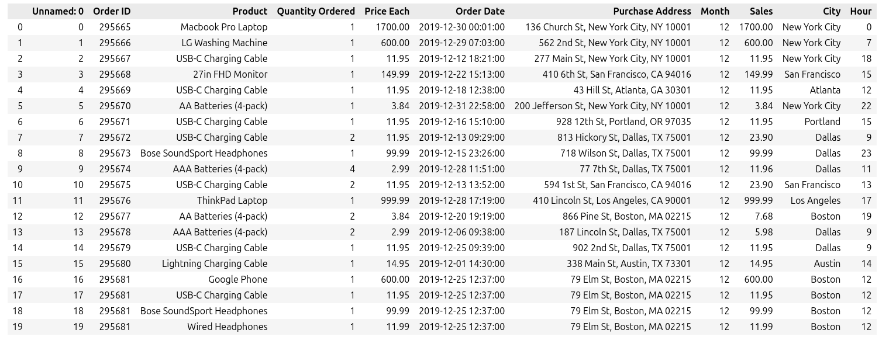

# {Análise exploratória de vendas}

Este repositório contém um projeto desenvolvido utilizando python. Neste arquivo README, você encontrará um guia passo a passo de como foi realizada está análise.  

------
___

### Pré-requisitos

Antes de começar, verifique se você possui as seguintes ferramentas instaladas em sua máquina:  

- Pandas   
- Seaborn  
- matplotlib  
  
### Passo 1: Instalar pacotes   

Caso não tenha os pacotes instalados utilize o seguinte comando para instala-los  

-------

~~~

pip install pandas  
pip install seaborn
pip install matplotlib

~~~

---------
_________

## Introdução ao projeto

O objetivo deste projeto de análise é explorar um conjunto de dados de vendas de produtos e dar insights sobre o desempenho das vendas e padrões de compra.  

Como objetivo do projeto é realizar as seguintes análises responder as seguintes perguntas   

- Cálculo do total de vendas por produto  

- Identificação do produto mais vendido  

- Análise da distribuição das vendas ao longo do tempo  

- Determinação da média de vendas por cidade  

- Identificação dos horários de picos de vendas  

 Logo com essas análises poderemos responder as seguintes perguntas.  

- - Qual o valor total de MacBook Pro vendidos?  

- -  Qual o produto mais vendido?  

- -  Qual o total de vendas do mês de setembro? (09)  

- -  Qual a média de vendas da cidade de Dallas?  

- - Qual o horário de pico de vendas?  

### Passo 1: Importando Pacotes 

~~~
import pandas as pd 
import seborn as sns
import matplotlib.pyplot as plt
~~~

Depois de importar os pacotes, carregaremos o arquivo csv, e abriremos o mesmo para termos uma visão geral e preliminar do arquivo.   

~~~

arquivo = pd.read_csv("DADOS/Sales Data.csv")
arquivo.head()

~~~

A pasta DADOS é o diretório onde está o arquivo csv no meu computador,  

  

Verificando os diferentes tipos de produtos 

~~~python

arquivo['Product'].unique()

~~~

Cuja a saída foi,

  

Agora vamos plotar os produtos x preços .  

~~~python

# verificando valor dos produtos 
plt.figure(figsize= (15,5)) # definindo o tamanho da figura 
sns.barplot(x = 'Product' , y = (('Price Each')) , data = arquivo)
plt.title("Produto x Preço de Cada Produto")
plt.xlabel("Produto")
plt.ylabel("Preço USD")
plt.ylim(0,2000)
plt.grid( alpha= 0.8, axis='y' )
plt.xticks(rotation = 65)
plt.tight_layout()

~~~

A saída  em um grafíco de barras comparando os preços de cada produto.    

   

Com base no gráfico, ou até uma análise no próprio arquivo, já respondemos a primeira pergunta. O produto mais caro é o Macbook pro  1700 dolares.   
Agora vamos ver quantos itens foram vendidos de cada item.

~~~Python

# criando um novo data frame com um groupby dos produtos para realizar a soma 
arquivos_novos  = arquivo.groupby(arquivo['Product']).agg({
    "Price Each" : ["mean","sum"],
    "Quantity Ordered" : "sum"
     }
).reset_index()
arquivos_novos.columns = ['Produto','Preço','Total Vendas',  'Quantidade Vendida']
arquivos_novos 

~~~
  
Usando o groupby para  somar os pedidos, somar cada compra  e verificar a quantidade de itens vendidos de cada produto  e somando o valor  total de venda .    
 

Nesta tabela podemos ver os itens mais vendidos e  os produtos que mais renderam lucro para as lojas e o preço de venda.   
Para visualizar em gráfico essas informações vamos plota-las    

~~~python

# verificando qual o produto que mais foi vendido 

plt.figure(figsize= (15,5))
sns.barplot(x ="Produto",y = "Quantidade Vendida", data = arquivos_novos)

plt.title("Produto x Valor vendido")
plt.xlabel("Produtos")
plt.ylabel("Soma do valor em Dolar")
plt.grid( alpha= 0.8, axis='y' )
plt.xticks(rotation = 65)
plt.tight_layout()

~~~

   

Agora vamos ver o valor do lucro nas vendas.   

~~~python

# plot de produtos mais vendidos
plt.figure(figsize= (15,5))
sns.barplot(x ="Produto",y = "Total Vendas", data = arquivos_novos)
plt.title("Produto x Total em Vendas")
plt.xlabel("Produtos")
plt.ylabel("Total 1e⁶6")
plt.grid( alpha= 0.8, axis='y' )
plt.xticks(rotation = 65)
plt.tight_layout()

~~~

  

Na tabela e gráficos acima podemos responder as perguntas em relação a quantidade e valor total dos macbooks vendidos sendo um total de 4728 unidades e mais de 8030800.00 dolares em vendas.    
No entanto o produto mais vendido foram as pilhas aaa que venderam mais de 30 mil unidades  
Com base nas análises acima, conseguimos responder duas das cinco perguntas.  

- Qual o valor total de MacBook Pro vendidos?  
 Foram 4728 unidades

- Qual o produto mais vendido?  
o Produto mais vendido foram as pilhas AAA com mais 27 mil unidades.   

Agora para responder as demais perguntas, vamos organizar os dados agrupando por meses para ver o total de vendas e quantitade de itens vendidos  por mês, vamos separar a unidade de Dalas, para fazer a análise somente nessa cidade como pedido na pergunta 4 e vamos agrupar por hora para saber o horário de pico de vendas.  

~~~python

# Agrupando por mes para ver qual o número de vendas no mes 
agrup_mes = arquivo.groupby(['Month', 'City']).agg({
    "Quantity Ordered": "sum",
    "Price Each" : "sum",
}).reset_index()

~~~

No comando acima foi utilizado o groupby para unir por mês e cidade agregando a soma da quantidade vendida e a soma do preço de cada produto.   

~~~python

plt.figure(figsize=(25,10))
sns.barplot( x = "Month",
             y = "Quantity Ordered",
             hue = 'City',
            data= agrup_mes)
plt.title("Meses X Quantidade")
plt.xlabel("Meses")
plt.ylabel("Quanttidade")
plt.xticks(rotation = 65)
plt.grid( alpha= 0.8, axis='y' )
plt.tight_layout()

~~~

Esse gráfico achei interessante pois compara cada cidade poderia gerar vários gráficos, mas achei esse intuitivo.
 
   

Assim podemos ver que Nova York é a cidade que mais vende produtos em todos os meses. No entanto essa informação não responde nenhuma das perguntas. Vamos lá, as perguntas são:

- Qual o total de vendas do mês de setembro? (09)  

- Qual a média de vendas da cidade de Dallas?  

- Qual o horário de pico de vendas?  

Calculando a quantidade de vendas no mês, a média de pedidos no mês e a soma de pedidos no mês.  

~~~python

Medias_mes = arquivo.groupby([ "Month"]).agg({
    "Sales": "mean",
    "Quantity Ordered" : ["sum",'mean']
}).reset_index()

~~~

  

Com isso respondemos a média de vendas no mês de setembro, 180 mil dolares, com um total de 13 mil pedidos,Também sabemos que o mês que mais tem vendas é o Dezembro, podemos separar por Cidade, para ter uma ideia do faturamento por cidade olhando o gráfico que vem depois (gráfico alguma numero), separando por cidade e soma mensal de vendas de produtos.  

Antes de ir para analisar somente a cidade de Dallas vamos verificar a hora em que ocorre o pico de vendas respondendo assim a última pergunta.   

~~~python

# Juntando por hora para analisar em qual hora ocorre o pico de vendas 
Medias_hora = arquivo.groupby([ "Hour"]).agg({
    "Sales": "mean",
    "Quantity Ordered" : ["sum"]
}).reset_index()
Medias_hora

~~~
  
   
 
 Como podemos ver na tabela o horário em que se tem mais vendas é as 19 horas.    
 
 
~~~python

Medias_Cidade = arquivo.groupby([ "City"]).agg({
    "Sales": "mean",
    "Quantity Ordered" : ["sum"]
}).reset_index()
Medias_Cidade

~~~

   

Com  a tabela acima vemos a média de vendas e de pedidos em todas as cidades incluindo Dallas com um pouco mais de 16 mil pedidos e 186 mil dolares .

--------------------------------------------------------------

Com isso temos todas as respostas.   

-- Qual o valor total de MacBook Pro vendidos?  
>4728 unidades.   

--  Qual o produto mais vendido?  
>As pilhas AAA com mais de 30 mil unidades vendidas.  
 
--  Qual o total de vendas do mês de setembro? (09)  

>No mes de setembro foram vendidos mais de 13 mil produtos (13109).  

--  Qual a média de vendas da cidade de Dallas?  
>E aproximadamente 186 mil dolares.

-- Qual o horário de pico de vendas?  
>O horário de pico de vendas é as 19 horas .

